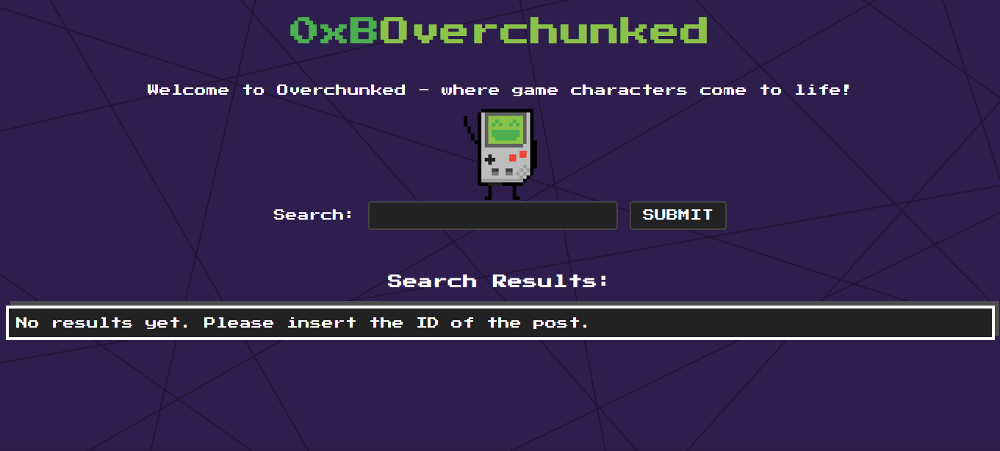
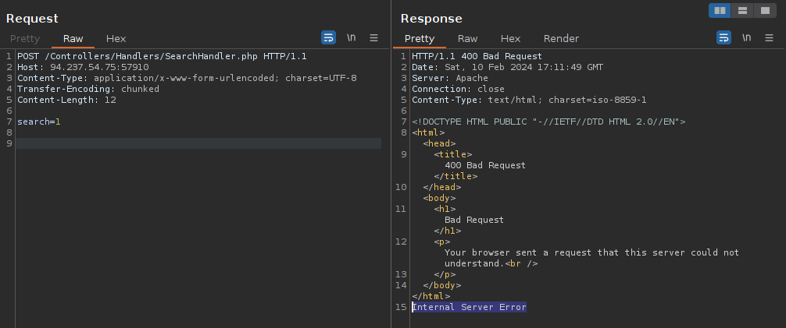
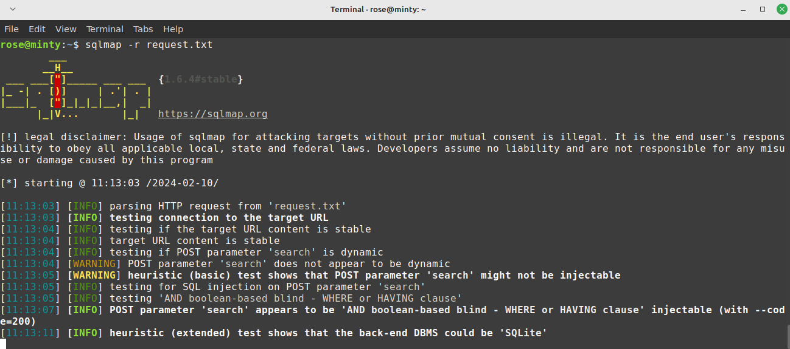

# WAF Bypass > SQL Injection

## Website 

## Description

This was a fun web challenge. I'll keep it short. The flag is stored in a SQLite database under "posts" with an id of 6. We can view posts 1-5 on the client-side, but not 6. Any attempt at SQL injection is blocked by the WAF. On the backend, the application takes user input from the search parameter. This input is passed to one of two functions depeneding on the Transfer-Encoding. It goes to safe_query if we aren't using chunked transfer-encoding. Safe_query uses a parameterized statement and implements a WAF that filters based on SQL query strings, essentially blocking any SQL injection attempts. But, if we have "Transfer-Encoding: chunked" set, our input is passed to an unsafe_Query function that includes our input directly in the SQL query, allowing us to inject malicious SQL code. So, using Bursuite, I was able to test the vulnerability found in the code. By setting the transfer encoding to chunked, the response showed "Internal Server Error", which indicated that I was on the right path. Now that I knew I was bypassing the WAF, I saved the request and fed it to SQLMAP to let it do the heavy lifting. WIthin a few minutes, I had the flag.

## Set Up

1. Burpsuite proxy and Repeater.
2. Read through the source code to understand how our requests are being handled.
3. Read up on transfer enoding after finding the vulnerability in the code. See more information.

## Burpsuite
Testing chunked transfer encoding using Burpsuite. Looking for an Internal Server Error:
 

## Exploit
Saved Burpsuite request to a file. Automated the SQLi exploitation using SQLMap: 
 

## More Information
[Transfer-Encoding](https://developer.mozilla.org/en-US/docs/Web/HTTP/Headers/Transfer-Encoding)

 The impact of this vulnerability is that it allows attackers to bypass implemented WAF and pull down all information from a database.

