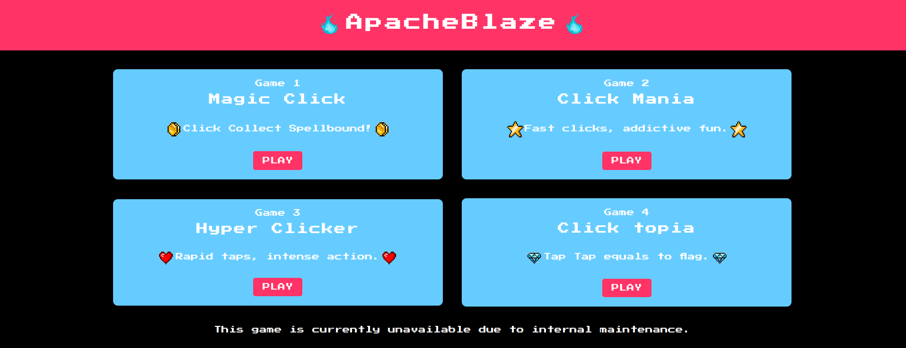
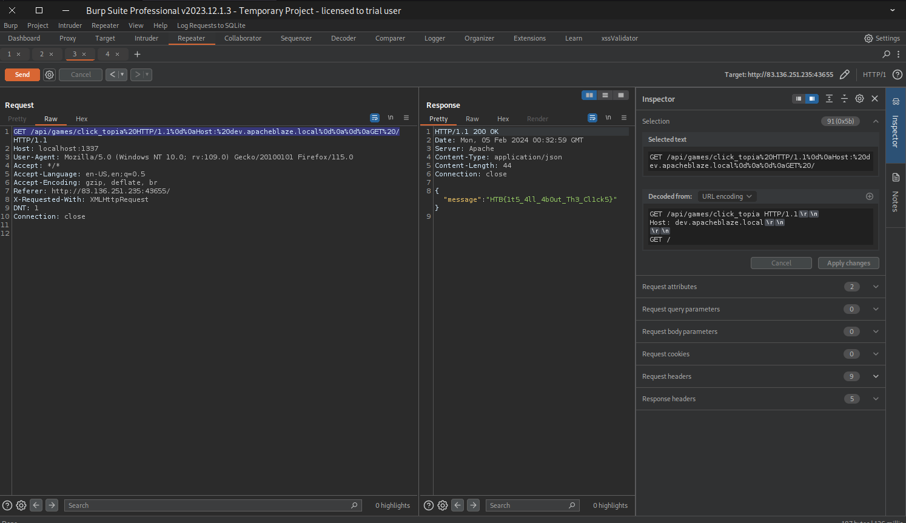

# HTML Request Smuggling > Apache Mod_Proxy 

## Website 



## Description

First of all, there is not a whole lot going on with this application. We're given the source code to look through. We can see the app.py, which basically checks for X-Forwarded-Host header to equal a certain value "dev.apacheblaze.local" for us to be able to access the data behind click_topia endpoint. Although, when we try to make a request with the mentioned host header set, we receive the same error. And so begins the googling, reading and ChatGPTing. Eventually, I decided to spin up the application locally and do some debugging to find that our headers aren't arriving as expected and some additional headers are being added to the request. Reviewing the Apache [mod_proxy](https://httpd.apache.org/docs/2.4/mod/mod_proxy.html) documentation shows why. "When acting in a reverse-proxy mode (using the ProxyPass directive, for example), mod_proxy_http adds several request headers in order to pass information to the origin server. These headers are: X-Forwarded-For, X-Forwarded-Host, and X-Forwarded-Server." Reviewing the httpd.conf shows Requests to /api/games/ are rewritten and proxied to http://127.0.0.1:8080/?game=$1, and the load balancer distributes traffic between http://127.0.0.1:8081 and http://127.0.0.1:8082 based on the specified load balancing method. Searching online reveals a CVE for HTML smuggling and a PoC. We are able to use this to retrieve the flag. More information on CVE-2023-25690 can be foun below.

## Set Up

1. Burpsuite Repeater.
2. Had to run the application locally for debugging purposes.
3. Reading a lot of Apache documentation. 
4. Request before being url encoded:
  ```html
GET /api/games/click_topia HTTP/1.1

Host: dev.apacheblaze.local


GET / HTTP/1.1

Host: localhost:1337
```
## Exploit


## More Information
Some mod_proxy configurations on Apache HTTP Server versions 2.4.0 through 2.4.55 allow a HTTP Request Smuggling attack. Configurations are affected when mod_proxy is enabled along with some form of RewriteRule or ProxyPassMatch in which a non-specific pattern matches some portion of the user-supplied request-target (URL) data and is then re-inserted into the proxied request-target using variable substitution. For example, something like:
```
RewriteEngine on 
RewriteRule "^/here/(.*)" "http://example.com:8080/elsewhere?$1"; [P] 
ProxyPassReverse /here/ http://example.com:8080/
```
[CVE-2023-25690-POC](https://github.com/dhmosfunk/CVE-2023-25690-POC/tree/main#internal-http-request-smuggling-via-header-injection)
<summary> The impact of this vulnerability is that it allows attackers to target and access internal applications that are meant to be hidden by the reverse proxy, potentially leading to unauthorized access, data leakage, or further exploitation.</summary>

