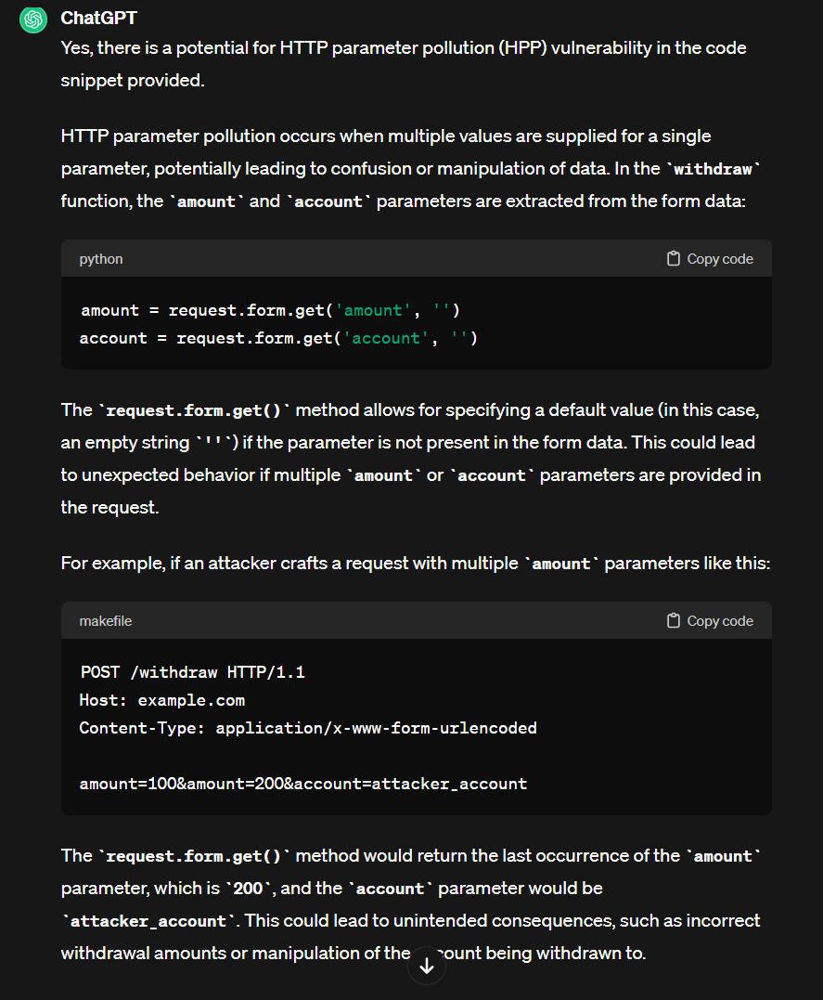
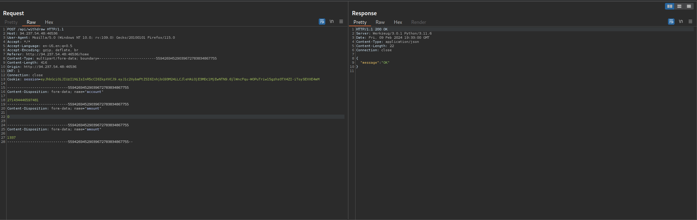

# HTTP Parameter Pollution

## Website 


## Description


## Set Up

1. Burpsuite Repeater.
2. Read through the source code (unnecessary now that value needed is in the description).
3. Read through the etherscan API documentation (unnecessary). 
4. POST to /api/withdraw before being exploiting:
  ```html
-----------------------------55942694529039672783834867755

Content-Disposition: form-data; name="account"
value

-----------------------------55942694529039672783834867755

Content-Disposition: form-data; name="amount"
value
-----------------------------55942694529039672783834867755--
```

## ChatGPT
Looking for vulnerabilities inside the source code with the help of ChatGPT:



## Exploit


## More Information
Some mod_proxy configurations on Apache HTTP Server versions 2.4.0 through 2.4.55 allow a HTTP Request Smuggling attack. Configurations are affected when mod_proxy is enabled along with some form of RewriteRule or ProxyPassMatch in which a non-specific pattern matches some portion of the user-supplied request-target (URL) data and is then re-inserted into the proxied request-target using variable substitution. For example, something like:
```python
RewriteEngine on 
RewriteRule "^/here/(.*)" "http://example.com:8080/elsewhere?$1"; [P] 
ProxyPassReverse /here/ http://example.com:8080/
```
[CVE-2023-25690-POC](https://github.com/dhmosfunk/CVE-2023-25690-POC/tree/main#internal-http-request-smuggling-via-header-injection)
<summary> The impact of this vulnerability is that it allows attackers to target and access internal applications that are meant to be hidden by the reverse proxy, potentially leading to unauthorized access, data leakage, or further exploitation.</summary>


