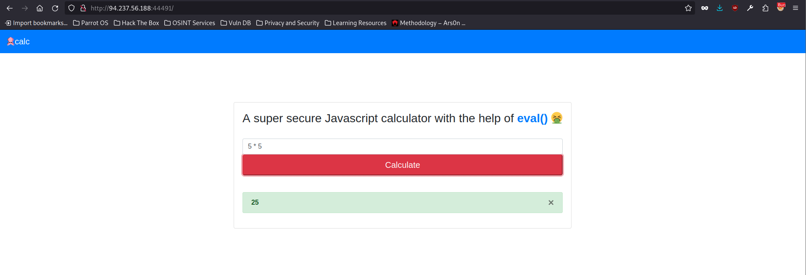
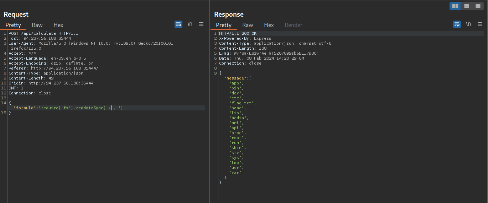

# Node JS Command Injection through JS eval()

## Website 



## Description

This was a very easy challenge that involved a NodeJS application taking unsanitized user input and passing it to the eval() method. By looking at the source code or sending a request through repeater we can identify the application as NodeJS. And the application straight up tells us it is using eval(). With this information, I was thinking xss at first, but knew that wouldn't be much help in this situation because were making a POST request, and there was no bot or user interaction, and the flag only appeared on the backend. The next thing I thought was was using NodeJS OS or fs commands directly through the web application. Not being a super 1337 h4ck3r, I went to the NodeJS apis documentation to review. I tried one of the OS module methods first "userInfo", which returned information for the root user. Now, all I had to do was grab the flag using the fs module.   

## Backend 

On the backend of the NodeJS application, we can see the vulnerable code using eval() with user provided input without any sort of sanitization:
<br>


## Set Up

1. Burpsuite Repeater for testing quickly testing payloads:
3. Source code review not really necessary.  
4. payload:
  ```JSON
{
"formula":"require('fs').readdirSync('/','')"
}

require('fs').readFileSync('/flag.txt').toString()
```


## Exploit


## More Information
[NodeJS APIs](https://nodejs.org/api/os.html)
<br>
[CMDi in Node and JS](https://www.nodejs-security.com/blog/introduction-command-injection-vulnerabilities-nodejs-javascript/)
<br>
[Examples Preventioin](https://www.stackhawk.com/blog/nodejs-command-injection-examples-and-prevention/)
<summary> The impact of this vulnerability is that it allows attackers to execute OS commands remotely.</summary>
