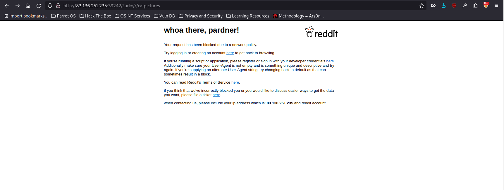
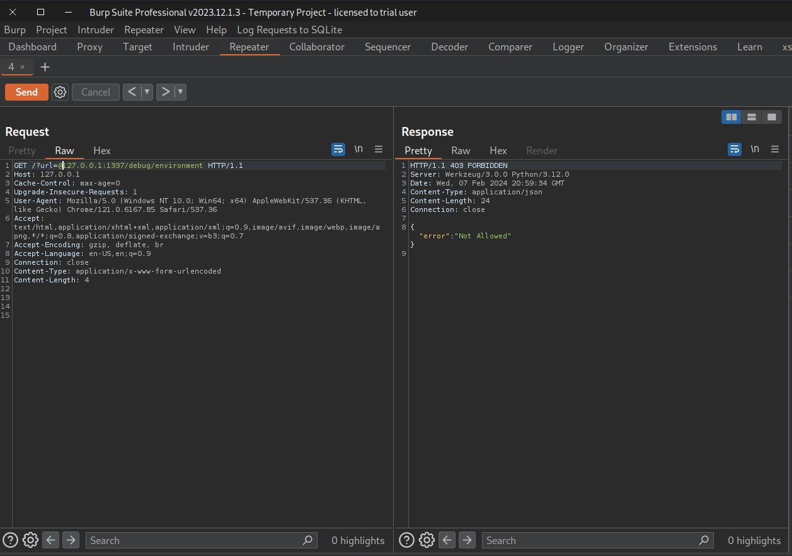

# SSRF Bypass Trick

## Website 

## Description

There isn't a whole lot to this website. Navigating to the application, we see a url parameter that takes a url. Here we can think SSRF attacks. Looking through the code, there are two endpoints, / and /environment. /environment is only accessible from the localhost, and contains the flag, so this is our target endpoint. From routes.py, we can see that the SITE_NAME variable, which is reddit.com, and url which is the parameter defined by the user, are used to construct the target_url. So, our payload needs to be something like: target_url = SITE_NAME{127.0.0.1/debug/enviorment/). Looking at util.py, I also noticed there are restricted urls that may affect our payload, such as '127' and 'localhost', but it doesn't include '0', which we can take advantage of in this case. SITE_NAME also doesn't include a '/' in the SITE_NAME variable after "reddit.com", and so we can take advantage of this by using a url manipulation trick found from payloadallthings. One last thing, we can't forget that our app is running on port 1337. So now, our final payload that allows us to access the internal endpoint /environment when handled by the application looks something like this: ?url=SITE_NAME@0.0.0.0:1337/debug/environment.

## Set Up

1. Burpsuite Repeater and collaborater for testing:

   
3. Had to review source code. 

## Exploit

## More Information

[SSRF payloads](https://github.com/swisskyrepo/PayloadsAllTheThings/blob/master/Server%20Side%20Request%20Forgery/README.md#bypass-using-tricks-combination)

 The impact of this vulnerability is that it allows attackers to target and access internal endpoints that are meant to be only reachable by the localhost.

